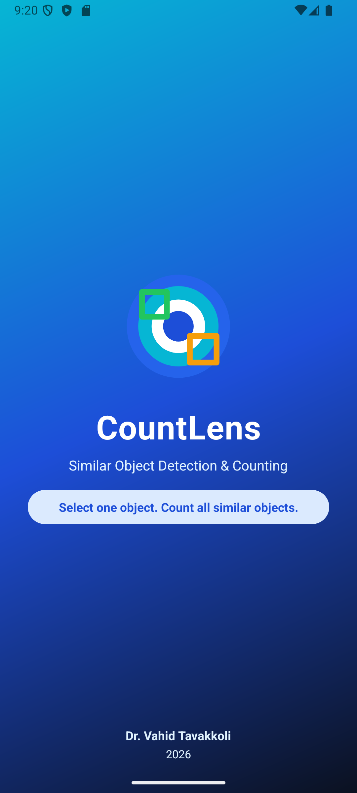
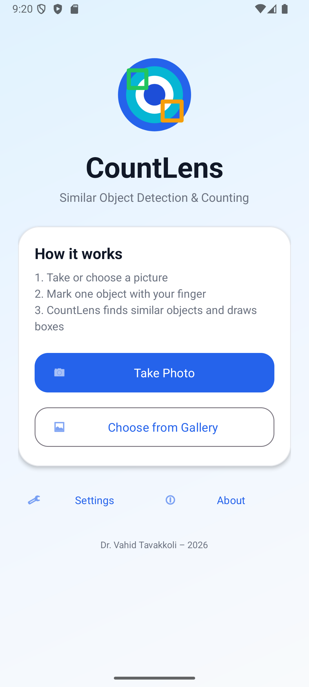
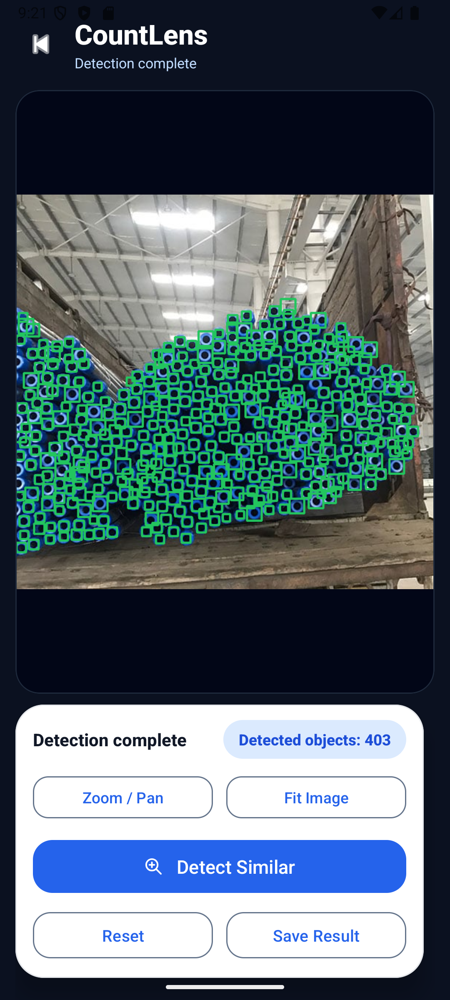

# CountLens - Similar Object Detection & Counting

CountLens is an advanced Android application designed to detect and count similar objects in images using computer vision. It is particularly effective for counting items like bottles, pills, fruits, or icons by using a single user-defined reference.

  

## 🌟 Features

- **Precise Object Selection**: Support for "Quadrant" (rotated rectangle) selection, allowing you to align with angled objects (like tilted bottles).
- **Multi-Algorithm Detection**:
    - **Color-First Segmentation**: Rapidly detects objects based on dominant hue and saturation.
    - **Shape Matching**: Rotation and scale-tolerant contour analysis for high-contrast objects.
    - **Rotated Template Matching**: A fallback mechanism for complex textures that respects user-defined orientation.
- **Object-Aware NMS**: A robust Non-Maximum Suppression (NMS) system that prevents double counting by merging overlapping fragments and suppressing containment.
- **Modern Android Support**: Fully compatible with **16 KB memory page sizes** introduced in Android 15.
- **Interactive UI**: Zoom and pan support for large images and high-contrast results display.

## 🛠️ Technology Stack

- **OpenCV 5.0 (Java API)**: Utilizes the latest module restructuring (using the `geometry` module for spatial analysis).
- **Android SDK**: Targeted for API 36 (Android 15+).
- **Kotlin & Java**: A hybrid codebase leveraging modern Android libraries.
- **Material Design 3**: Clean and accessible user interface.

## 🚀 Getting Started

### Prerequisites

- Android Studio Meerkat (or newer)
- Android NDK (r28 or higher recommended for 16 KB alignment)
- A device or emulator running Android 8.0 (API 26) or higher.

### Installation

1. Clone the repository.
2. Open the project in Android Studio.
3. Sync Gradle to download dependencies (OpenCV 5.0).
4. Build and run the app on your device.

## 📖 How to Use

1. **Input**: Take a photo or choose an image from your gallery.
2. **Select**: Draw a box around **one** object you want to count.
3. **Rotate**: Use the handle above the selection box to match the object's orientation if it is tilted.
4. **Detect**: Tap "Detect Similar" to see the results.
5. **Tune**: If results are fragmented or missed, use the **Settings** menu to adjust the Matching Sensitivity or NMS Overlap.

## 🔧 Technical Notes

### 16 KB Page Compatibility
This app uses `useLegacyPackaging = true` and `android:extractNativeLibs="true"` to ensure compatibility with 16 KB page size devices when using prebuilt OpenCV binaries.

### OpenCV 5.0 Migration
The project follows the OpenCV 5.0 architectural changes, specifically importing `org.opencv.geometry.Geometry` for methods like `contourArea` and `boundingRect`.

---
*Developed for Android Computer Vision Teaching & Research.*
