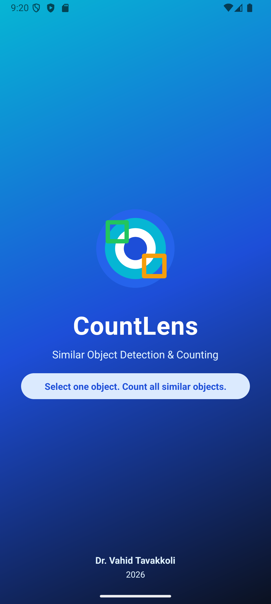
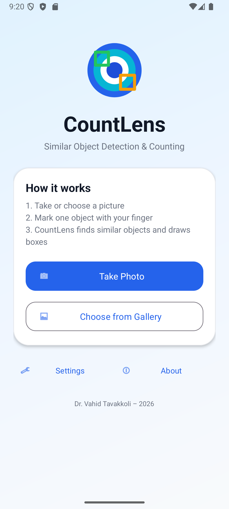
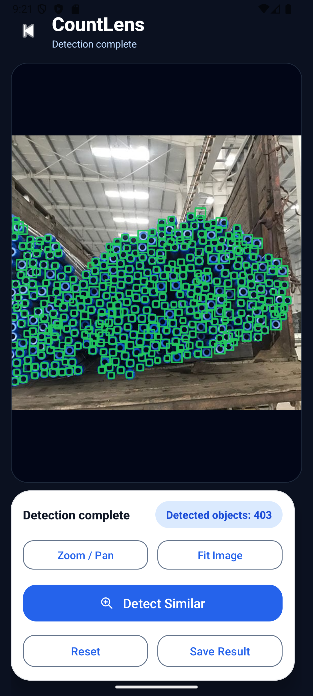

# CountLens

**Private, offline object detection and counting for Android.**

[](https://github.com/vtavakkoli/CountLens/actions/workflows/android-ci.yml)

CountLens counts objects directly on an Android device using OpenCV. It does not upload photos, require an account, or depend on a cloud API. For the most accurate result, select one example object; CountLens then finds and counts similar instances. A second adaptive mode can automatically count scenes containing many visually separate, repeated objects.

<p align="center">
  
  
  
</p>

## Counting modes

### 1. Count a selected object — recommended

Draw a rectangle or circle around one complete object. CountLens combines several complementary methods:

- dominant-color and foreground segmentation;
- contrast and shape matching;
- dedicated ring/circle detection for dense circular objects;
- rotation- and scale-aware template fallback;
- object-aware non-maximum suppression for overlapping and nested detections.

This mode is best for bottles, pills, fruit, packages, symbols, components, pipe openings, and other repeated objects where the user can provide one example.

### 2. Auto-count repeated objects

The reference-free pipeline fuses:

- automatically tuned Canny edges;
- adaptive light/dark foreground segmentation;
- morphological cleanup;
- Hough-circle proposals;
- duplicate and containment suppression;
- robust dominant-scale filtering to reject background structures and size outliers.

Automatic mode works best when objects are visually separated and occur at broadly similar sizes. A reference selection remains more reliable for touching objects, cluttered backgrounds, large perspective changes, or several unrelated object classes.

## Highlights

- **100% on-device processing** — no image upload or analytics dependency.
- **Full-resolution camera capture** — uses a secure `FileProvider`, not the camera preview thumbnail.
- **Memory-aware image decoding** — large images are sampled and orientation-corrected before analysis.
- **Interactive inspection** — zoom, pan, fit-to-screen, rotated selection, and numbered boxes.
- **Modern export** — results are written to `Pictures/CountLens` using scoped `MediaStore` storage.
- **Configurable accuracy/speed** — matching threshold, NMS overlap, selection shape, and analysis resolution.
- **Modern Android support** — API 27+, target API 36, and 16 KB native-library packaging support.
- **Automated validation** — unit tests, Android lint, and debug APK build run in GitHub Actions.

## Technology

| Area | Implementation |
|---|---|
| Computer vision | OpenCV 5 Java API |
| Application | Android SDK, Java 11 source compatibility |
| UI | Material Design 3, AndroidX |
| Image input | Activity Result API, `FileProvider`, `ImageDecoder`/sampled `BitmapFactory` |
| Persistence | SharedPreferences settings, scoped `MediaStore` export |
| Quality | JUnit, Android lint, GitHub Actions |

## Build and run

### Requirements

- Android Studio compatible with Android Gradle Plugin 9.2+
- JDK 17
- Android SDK 36
- Android device or emulator running Android 8.1 (API 27) or newer

### Steps

```bash
git clone https://github.com/vtavakkoli/CountLens.git
cd CountLens
./gradlew assembleDebug
```

The debug APK is generated at:

```text
app/build/outputs/apk/debug/app-debug.apk
```

To run all local checks:

```bash
./gradlew testDebugUnitTest lintDebug assembleDebug
```

## Usage tips

1. Use a sharp image with even lighting when possible.
2. For maximum accuracy, select one complete object with a small margin around it.
3. Use the circle tool for round objects and the rectangle tool for general shapes.
4. Lower the matching threshold when rotated, partly hidden, or differently sized objects are missed.
5. Increase the threshold when the result contains visually similar false positives.
6. Use automatic mode for repeated objects on a relatively simple background; switch to selected-object mode for difficult scenes.

## Architecture

```text
Camera / Gallery
       │
       ▼
Sampled, orientation-aware bitmap decoding
       │
       ├── Selected-object pipeline
       │     ├── reference foreground analysis
       │     ├── color / contrast / shape candidates
       │     ├── ring detector or template fallback
       │     └── object-aware NMS
       │
       └── Automatic repeated-object pipeline
             ├── adaptive threshold + tuned edges
             ├── contour and circle proposals
             ├── duplicate suppression
             └── dominant-scale filtering
       │
       ▼
Numbered detections + count + gallery export
```

## Known limitations

CountLens is an offline classical-computer-vision application, not a general semantic detector. Automatic mode cannot always decide what a human considers an “object” in an arbitrary mixed scene. Strong shadows, severe overlap, transparent objects, repetitive background texture, and extreme perspective changes can reduce accuracy. The selected-object workflow is intentionally the primary mode because it gives the detector a clear target without requiring a large machine-learning model.

## Privacy

Photos remain on the device. The application does not request internet access and does not require broad gallery-read permission. Gallery selection uses a temporary system-granted URI, and camera capture is delegated securely to the installed camera application.

## Project status

CountLens is suitable for Android computer-vision teaching, experiments, and practical offline counting. Contributions should include a reproducible sample image or test case and a description of the expected count.

---

Developed by **Dr. Vahid Tavakkoli** for Android computer-vision teaching and research.
